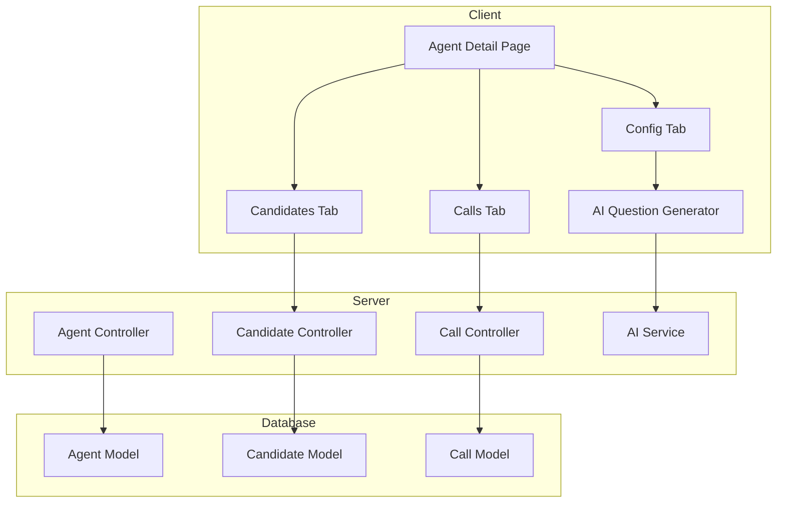

# Design Document

## Overview

This design document outlines the implementation of the Agent Calls Management feature, which introduces a Call schema for tracking interview sessions, AI-powered question generation with predefined pillar prompts, and a redesigned Agent detail page with three tabs. The system allows candidates to exist independently and be assigned to agents, automatically creating scheduled call records upon assignment.

## Architecture

The feature follows the existing client-server architecture:



## Components and Interfaces

### Backend Components

#### Call Model (`server/src/models/call.model.ts`)
```typescript
interface ICall extends Document {
  candidateId: mongoose.Types.ObjectId;
  agentId: mongoose.Types.ObjectId;
  status: 'scheduled' | 'in_progress' | 'completed';
  scheduledTime: Date;
  recordingUrl: string;
  createdAt: Date;
  updatedAt: Date;
}
```

#### Call Controller (`server/src/controllers/call.controller.ts`)
- `createCall(candidateId, agentId, scheduledTime)` - Create a new call record
- `getCallsByAgent(agentId)` - Get all calls for an agent
- `getCallsByCandidate(candidateId)` - Get all calls for a candidate
- `updateCallStatus(callId, status)` - Update call status
- `updateCall(callId, data)` - Update call details

#### Call Routes (`server/src/routes/call.routes.ts`)
- `POST /api/calls` - Create call
- `GET /api/calls/agent/:agentId` - Get calls by agent
- `GET /api/calls/candidate/:candidateId` - Get calls by candidate
- `PATCH /api/calls/:id` - Update call
- `PATCH /api/calls/:id/status` - Update call status

#### AI Question Service (`server/src/services/question.service.ts`)
- `generateQuestions(pillar, prompt, jobDetails)` - Generate questions using AI based on pillar and prompt

### Frontend Components

#### Pillar Prompts (Hardcoded in Frontend)
```typescript
const PILLAR_PROMPTS = {
  experience: "Generate interview questions to assess the candidate's relevant work experience, past projects, and professional background for the role of {jobTitle}.",
  behavioral: "Generate behavioral interview questions using the STAR method to evaluate the candidate's soft skills, teamwork, and problem-solving abilities for the role of {jobTitle}.",
  role_specific: "Generate technical and role-specific interview questions to assess the candidate's skills and knowledge required for the role of {jobTitle}.",
  cultural_fit: "Generate interview questions to evaluate if the candidate aligns with company values, work style, and team dynamics for the role of {jobTitle}."
};
```

#### Agent Detail Page Tabs
- **Config Tab**: Agent configuration with question management and AI generation
- **Candidates Tab**: List of assigned candidates with assignment/removal actions
- **Calls Tab**: List of scheduled calls with status and details

#### Question Generator Component
- Pillar selector dropdown
- Prompt display/edit textarea
- "Generate with AI" button
- Generated questions list with edit/delete actions
- Manual question input field

#### Candidate Assignment Component
- Unassigned candidates list
- Scheduled time picker
- Assign button (creates Call record automatically)

### API Interfaces

#### Create Call Request
```typescript
interface CreateCallRequest {
  candidateId: string;
  agentId: string;
  scheduledTime: string; // ISO date string
}
```

#### Generate Questions Request
```typescript
interface GenerateQuestionsRequest {
  pillar: 'experience' | 'behavioral' | 'role_specific' | 'cultural_fit';
  prompt: string;
  jobTitle: string;
  jobDescription?: string;
}
```

#### Generate Questions Response
```typescript
interface GenerateQuestionsResponse {
  questions: string[];
}
```

## Data Models

### Call Schema
```typescript
{
  candidateId: ObjectId,      // Reference to Candidate
  agentId: ObjectId,          // Reference to Agent
  status: String,             // 'scheduled' | 'in_progress' | 'completed'
  scheduledTime: Date,        // When the call is scheduled
  recordingUrl: String,       // URL to call recording (optional)
  createdAt: Date,
  updatedAt: Date
}
```

### Updated Candidate Schema
The existing Candidate model will be modified to make `agentId` optional:
```typescript
{
  agentId: ObjectId | null,   // Optional - null when unassigned
  name: String,
  email: String,
  phone: String,
  resume: String,
  createdAt: Date,
  updatedAt: Date
}
```


## Correctness Properties

*A property is a characteristic or behavior that should hold true across all valid executions of a system-essentially, a formal statement about what the system should do. Properties serve as the bridge between human-readable specifications and machine-verifiable correctness guarantees.*

### Property 1: Candidate Assignment Creates Call Record
*For any* candidate and agent, when a candidate is assigned to an agent with a scheduled time, a Call record SHALL be created with status "scheduled", the correct candidateId, agentId, and scheduledTime.
**Validates: Requirements 1.1, 4.2**

### Property 2: Call Record Field Integrity
*For any* Call record created in the system, the record SHALL contain non-null candidateId, agentId, status (one of "scheduled", "in_progress", "completed"), and scheduledTime fields.
**Validates: Requirements 1.2**

### Property 3: Call Status Transition Validity
*For any* call status update operation, the system SHALL only accept status values from the set {"scheduled", "in_progress", "completed"} and reject all other values.
**Validates: Requirements 1.3**

### Property 4: Agent Calls Query Completeness
*For any* agent with associated calls, querying calls by agentId SHALL return exactly all Call records where the agentId matches, with no missing or extra records.
**Validates: Requirements 1.4**

### Property 5: Question List Manipulation Consistency
*For any* question list:
- Adding a valid question SHALL increase the list length by exactly 1
- Editing a question SHALL preserve the list length and update only the targeted question
- Deleting a question SHALL decrease the list length by exactly 1 and remove only the targeted question
**Validates: Requirements 2.3, 2.4, 2.5**

### Property 6: Pillar Prompt Selection Correctness
*For any* pillar selection from {experience, behavioral, role_specific, cultural_fit}, the system SHALL return the corresponding predefined prompt template for that pillar.
**Validates: Requirements 3.2**

### Property 7: Custom Prompt Passthrough
*For any* modified or custom prompt provided by the user, the AI service SHALL receive exactly that prompt text (not the default) when generating questions.
**Validates: Requirements 3.3, 3.4**

### Property 8: Candidate AgentId Update on Assignment
*For any* unassigned candidate assigned to an agent, the candidate's agentId field SHALL be updated to reference that agent's ID.
**Validates: Requirements 4.1**

### Property 9: Single Agent Assignment Constraint
*For any* candidate already assigned to an agent, attempting to assign that candidate to a different agent SHALL fail and leave the candidate's agentId unchanged.
**Validates: Requirements 4.3**

### Property 10: Candidate Removal Clears AgentId
*For any* candidate removed from an agent, the candidate's agentId SHALL be set to null.
**Validates: Requirements 4.4**

### Property 11: Candidates Tab Shows Assigned Candidates
*For any* agent, the Candidates tab SHALL display exactly the candidates whose agentId matches that agent's ID.
**Validates: Requirements 5.3**

### Property 12: Independent Candidate Creation
*For any* valid candidate data without an agentId, the system SHALL successfully create the candidate with agentId set to null.
**Validates: Requirements 6.1**

### Property 13: Unassigned Candidates Filter
*For any* set of candidates in the system, filtering for unassigned candidates SHALL return exactly those candidates where agentId is null or undefined.
**Validates: Requirements 6.2**

## Error Handling

### Backend Error Handling

| Error Scenario | HTTP Status | Error Message |
|----------------|-------------|---------------|
| Invalid candidateId format | 400 | "Invalid candidate ID format" |
| Invalid agentId format | 400 | "Invalid agent ID format" |
| Candidate not found | 404 | "Candidate not found" |
| Agent not found | 404 | "Agent not found" |
| Call not found | 404 | "Call not found" |
| Candidate already assigned | 409 | "Candidate is already assigned to an agent" |
| Invalid call status | 400 | "Invalid status. Must be one of: scheduled, in_progress, completed" |
| AI service failure | 503 | "AI service temporarily unavailable" |
| Missing required fields | 400 | "Missing required field: {fieldName}" |

### Frontend Error Handling

- Display toast notifications for API errors
- Show loading states during API calls
- Disable submit buttons during pending operations
- Validate form inputs before submission
- Handle network errors with retry option

NEVER WRITE Unit test or testing code