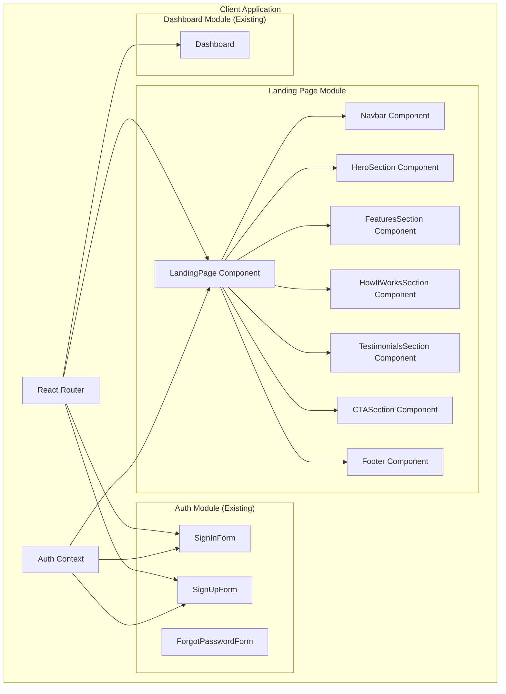

# Design Document: HiringAI Landing Page

## Overview

This design document outlines the architecture and implementation approach for the HiringAI Landing Page feature. The landing page serves as the primary entry point for the product, showcasing its value proposition to recruiters and providing seamless access to authentication flows.

The implementation will leverage the existing React/TypeScript client architecture with Vite, shadcn/ui components, and React Router. The landing page will be a new route component that integrates with the existing authentication context and navigation system.

## Architecture



## Components and Interfaces

### LandingPage Component
The main container component that orchestrates all landing page sections.

```typescript
interface LandingPageProps {
  // No props - uses AuthContext for auth state
}

// Redirects authenticated users to dashboard
// Renders all landing page sections for unauthenticated visitors
```

### LandingNavbar Component
Fixed navigation bar with logo, links, and auth buttons.

```typescript
interface LandingNavbarProps {
  // No props - self-contained navigation
}

// Contains: Logo, nav links (Features, How It Works), Sign In button, Get Started button
// Sticky positioning at top of viewport
// Mobile: Hamburger menu with slide-out drawer
```

### HeroSection Component
Primary above-the-fold content with headline and CTA.

```typescript
interface HeroSectionProps {
  // No props - static content
}

// Contains: Main headline, subheadline, primary CTA button, hero image/illustration
```

### FeaturesSection Component
Grid display of key product capabilities.

```typescript
interface Feature {
  icon: React.ReactNode;
  title: string;
  description: string;
}

interface FeaturesSectionProps {
  features: Feature[];
}

// Displays Assessment Pillars and key capabilities
// Responsive grid: 1 col mobile, 2 col tablet, 4 col desktop
```

### HowItWorksSection Component
Step-by-step process explanation.

```typescript
interface Step {
  number: number;
  title: string;
  description: string;
  icon: React.ReactNode;
}

interface HowItWorksSectionProps {
  steps: Step[];
}

// Three steps: Job Setup, AI Interview, Assessment Report
```

### TestimonialsSection Component
Social proof with quotes and statistics.

```typescript
interface Testimonial {
  quote: string;
  author: string;
  role: string;
  company: string;
}

interface TestimonialsSectionProps {
  testimonials: Testimonial[];
  stats: { value: string; label: string }[];
}
```

### CTASection Component
Final call-to-action before footer.

```typescript
interface CTASectionProps {
  // No props - static content with navigation
}

// Contains: Compelling headline, Get Started button
```

### Footer Component
Site footer with links and copyright.

```typescript
interface FooterProps {
  // No props - static content
}

// Contains: Logo, navigation links, social links, copyright
```

## Data Models

### Navigation Links
```typescript
interface NavLink {
  label: string;
  href: string;
  isExternal?: boolean;
}

const navLinks: NavLink[] = [
  { label: 'Features', href: '#features' },
  { label: 'How It Works', href: '#how-it-works' },
  { label: 'Pricing', href: '#pricing' },
];
```

### Feature Data
```typescript
const features: Feature[] = [
  {
    icon: <CheckCircle />,
    title: 'Experience Verification',
    description: 'AI validates technical depth and work history with intelligent follow-up questions.',
  },
  {
    icon: <MessageSquare />,
    title: 'Behavioral Assessment',
    description: 'STAR method questions evaluate problem-solving and situational responses.',
  },
  {
    icon: <Brain />,
    title: 'Role-Specific Knowledge',
    description: 'Custom questions assess tools, frameworks, and domain expertise.',
  },
  {
    icon: <Users />,
    title: 'Cultural Fit Analysis',
    description: 'Evaluate alignment with company values and work style preferences.',
  },
];
```

### How It Works Steps
```typescript
const steps: Step[] = [
  {
    number: 1,
    title: 'Set Up Your Job',
    description: 'Provide your company website and job description. Our AI extracts context automatically.',
    icon: <Briefcase />,
  },
  {
    number: 2,
    title: 'AI Conducts Interviews',
    description: 'Candidates receive calls from our voice agent for natural, conversational screening.',
    icon: <Phone />,
  },
  {
    number: 3,
    title: 'Review Assessments',
    description: 'Get detailed scorecards, transcripts, and recommendations for each candidate.',
    icon: <FileText />,
  },
];
```

## Correctness Properties

*A property is a characteristic or behavior that should hold true across all valid executions of a system-essentially, a formal statement about what the system should do. Properties serve as the bridge between human-readable specifications and machine-verifiable correctness guarantees.*

Based on the prework analysis, the following correctness properties have been identified:

### Property 1: Empty field validation on sign-in
*For any* sign-in form submission where email or password fields are empty, the form SHALL display validation errors for each empty field and prevent submission.
**Validates: Requirements 5.4**

### Property 2: Invalid field validation on registration
*For any* registration form submission with invalid data (invalid email format, password too short, mismatched passwords, empty required fields), the form SHALL display specific validation errors for each invalid field.
**Validates: Requirements 6.3**

### Property 3: Short password rejection
*For any* password input with fewer than 6 characters on the registration form, the form SHALL display a validation error indicating the minimum length requirement.
**Validates: Requirements 6.4**

## Error Handling

### Navigation Errors
- Invalid routes: React Router handles with 404 fallback
- Auth redirect failures: Graceful fallback to landing page

### Form Validation Errors
- Client-side validation using Zod schemas (already implemented)
- Display inline error messages below each invalid field
- Prevent form submission until validation passes

### API Errors
- Network failures: Display user-friendly error message
- Authentication failures: Show specific error (invalid credentials, email taken)
- Rate limiting: Display retry message with countdown

### Loading States
- Show spinner during authentication requests
- Disable form buttons during submission
- Skeleton loading for any dynamic content


NOTE: NO TESTING STRATEGIES OR CODE NEEDED
