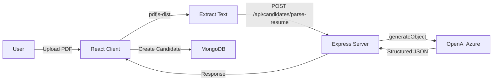

# Design Document: Resume Parser

## Overview

This feature adds PDF resume parsing and structured storage to the candidate management system. The implementation follows a client-server architecture where:

1. Client-side: PDF text extraction using pdfjs-dist (as per reference code)
2. Server-side: New API endpoint that uses existing OpenAI integration to parse raw text into structured JSON
3. Database: Updated candidate schema to store resume as a nested JSON object

The feature replaces the current "paste text" resume input with a file upload component.

## Architecture



### Data Flow

1. User selects PDF file in Add Candidate form
2. Client extracts text using pdfjs-dist (client-side, no upload)
3. Client sends extracted text to `POST /api/candidates/parse-resume`
4. Server uses OpenAI to parse text into structured JSON
5. Server returns structured resume data
6. Client populates form fields and stores structured resume on candidate creation

## Components and Interfaces

### Client Components

#### 1. ResumeUploader Component
New component replacing the textarea in AddCandidateForm.

```typescript
interface ResumeUploaderProps {
  onParsed: (resume: ParsedResume) => void;
  onError: (error: string) => void;
}
```

#### 2. PDF Service (client/src/services/pdf.service.ts)
Handles PDF text extraction using pdfjs-dist.

```typescript
// Extract text from PDF file
export async function extractTextFromPDF(file: File): Promise<string>;
```

#### 3. Candidate API Extension
New method to parse resume text.

```typescript
// In candidate.api.ts
parseResume: async (text: string): Promise<ParsedResume>;
```

### Server Components

#### 1. Resume Parser Service (server/src/services/resume.service.ts)
New service using existing OpenAI setup.

```typescript
export interface ParsedResume {
  name?: string;
  email?: string;
  phone?: string;
  skills: string[];
  experience: ExperienceEntry[];
  education: EducationEntry[];
  rawText: string;
}

export interface ExperienceEntry {
  company: string;
  role: string;
  duration: string;
  description: string;
}

export interface EducationEntry {
  institution: string;
  degree: string;
  field: string;
  graduationDate?: string;
}

export async function parseResumeText(text: string): Promise<ParsedResume>;
```

#### 2. Candidate Controller Extension
New endpoint for resume parsing.

```typescript
// POST /api/candidates/parse-resume
export const parseResume = async (req: Request, res: Response, next: NextFunction);
```

## Data Models

### Updated Candidate Schema

```typescript
// server/src/models/candidate.model.ts
export interface IResume {
  name?: string;
  email?: string;
  phone?: string;
  skills: string[];
  experience: {
    company: string;
    role: string;
    duration: string;
    description: string;
  }[];
  education: {
    institution: string;
    degree: string;
    field: string;
    graduationDate?: string;
  }[];
  rawText: string;
}

export interface ICandidate extends Document {
  agentId: mongoose.Types.ObjectId | null;
  name: string;
  email: string;
  phone: string;
  resume: IResume | null;  // Changed from string to IResume
  createdAt: Date;
  updatedAt: Date;
}
```

### Client Types

```typescript
// client/src/services/candidate.api.ts
export interface ParsedResume {
  name?: string;
  email?: string;
  phone?: string;
  skills: string[];
  experience: {
    company: string;
    role: string;
    duration: string;
    description: string;
  }[];
  education: {
    institution: string;
    degree: string;
    field: string;
    graduationDate?: string;
  }[];
  rawText: string;
}

export interface Candidate {
  _id: string;
  agentId: string | { _id: string; name: string; jobDetails?: { title: string } } | null;
  name: string;
  email: string;
  phone: string;
  resume: ParsedResume | null;  // Changed from string
  createdAt: string;
  updatedAt: string;
}
```

## Correctness Properties

*A property is a characteristic or behavior that should hold true across all valid executions of a system-essentially, a formal statement about what the system should do. Properties serve as the bridge between human-readable specifications and machine-verifiable correctness guarantees.*

Based on the prework analysis, the following properties can be tested:

### Property 1: Parse response contains required fields
*For any* successful response from the parse-resume endpoint, the returned JSON object SHALL contain all required fields: skills (array), experience (array), education (array), and rawText (string).
**Validates: Requirements 2.2**

### Property 2: Personal information preservation
*For any* input text containing identifiable information (names, emails, phone numbers), the parsed output rawText field SHALL contain the same identifiable information without redaction.
**Validates: Requirements 2.4**

### Property 3: Resume schema validation
*For any* resume object being stored in the candidate document, the object SHALL conform to the IResume schema structure with valid types for all fields.
**Validates: Requirements 3.2**

### Property 4: Candidate resume round-trip
*For any* candidate with resume data, storing and then retrieving the candidate SHALL return a resume object equivalent to what was stored.
**Validates: Requirements 3.3**

## Error Handling

### Client-Side Errors

| Error | Handling |
|-------|----------|
| Non-PDF file selected | Display error message, reject file |
| PDF extraction fails | Display error message with retry option |
| Parse API fails | Display error message, allow manual entry |
| Network error | Display connection error message |

### Server-Side Errors

| Error | Status Code | Response |
|-------|-------------|----------|
| Missing text in request | 400 | `{ success: false, message: "Resume text is required" }` |
| OpenAI API failure | 500 | `{ success: false, message: "Failed to parse resume" }` |
| Invalid response from AI | 500 | `{ success: false, message: "Failed to parse resume structure" }` |

## Testing Strategy

### Dual Testing Approach

This feature uses both unit tests and property-based tests for comprehensive coverage.

### Unit Tests

1. **PDF Service Tests**
   - Test extractTextFromPDF with valid PDF
   - Test error handling for invalid files

2. **Resume Service Tests**
   - Test parseResumeText returns valid structure
   - Test error handling when OpenAI fails

3. **API Endpoint Tests**
   - Test POST /api/candidates/parse-resume with valid text
   - Test validation errors for missing text

4. **Component Tests**
   - Test ResumeUploader file selection
   - Test error state display

### Property-Based Tests

Using `fast-check` library for property-based testing.

1. **Property 1: Parse response structure**
   - Generate random resume text strings
   - Verify response always contains required fields with correct types

2. **Property 2: PII preservation**
   - Generate text with embedded PII patterns
   - Verify rawText contains original PII

3. **Property 3: Schema validation**
   - Generate random resume objects
   - Verify Mongoose validation accepts valid objects and rejects invalid ones

4. **Property 4: Round-trip consistency**
   - Generate valid resume objects
   - Store in candidate, retrieve, compare equality

### Test Configuration

- Property tests run minimum 100 iterations
- Each property test tagged with format: `**Feature: resume-parser, Property {number}: {property_text}**`
