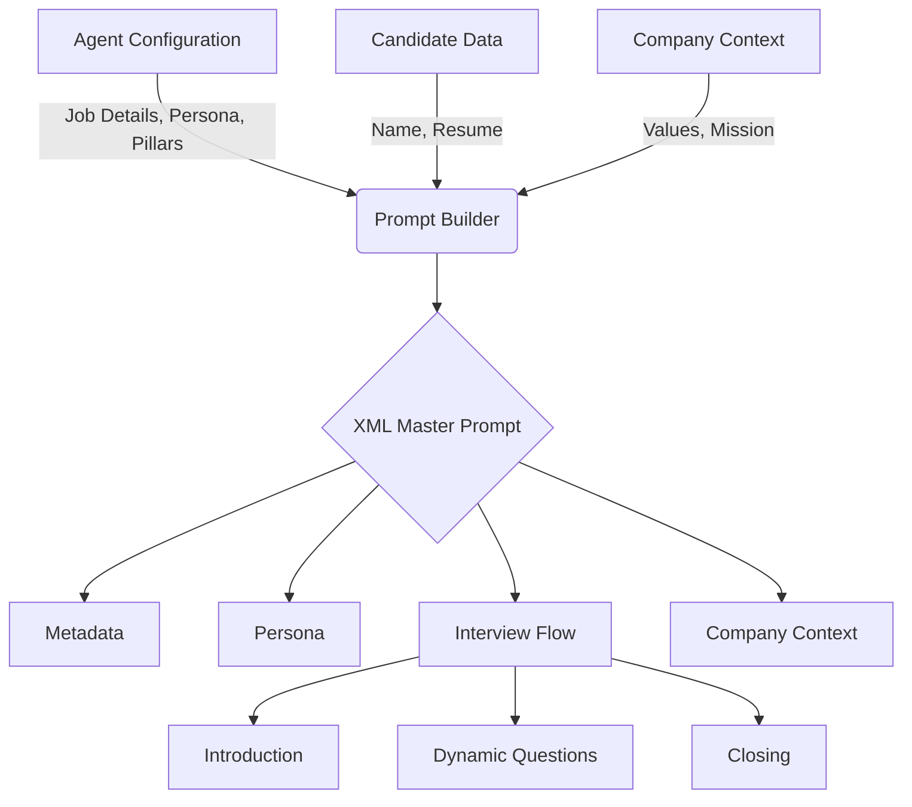
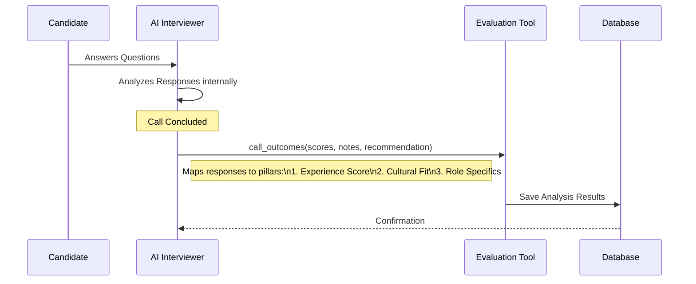

# HiringAI: The Future of Automated Recruitment 

##  Project Overview

**HiringAI** is an advanced AI-powered telephony platform designed to revolutionize the recruitment process by automating the initial phone screening round.

###  The Pain Points
Recruitment teams today face significant challenges:
*   **High Volume**: Reviewing hundreds of resumes and scheduling dozens of screening calls is overwhelming.
*   **Time-Consuming**: Initial screenings are repetitive, often asking the same questions to every candidate.
*   **Inconsistency**: Human bias and fatigue can lead to inconsistent evaluation of candidates.
*   **Slow Feedback Loops**: Scheduling conflicts delay the process, resulting in lost top talent.

###  The Solution
HiringAI solves these problems by deploying **AI Agents** that:
1.  **Call Candidates Automatically**: No more scheduling tag. The AI calls candidates at their convenience.
2.  **Conduct Structured Interviews**: The AI follows a strict, fair, and consistent interview script tailored to the job description.
3.  **Evaluate Instantly**: Real-time analysis of candidate responses against defined "pillars" (Experience, Culture, etc.).
4.  **Provide Actionable Insights**: Recruiters receive a detailed scorecard with recordings, transcripts, and hiring recommendations immediately after the call.

---

##  Dynamic Prompt Construction

The core of our AI interviewer is a dynamically constructed **XML Prompt**. This prompt ensures the AI stays in character, follows the interview flow, and adheres to company guidelines.

###  How We Build the Prompt
We assemble the prompt in real-time (`server/src/utils/promptBuilder.ts`) using the following context:

1.  **Metadata**: Specifics about the role (Job Title, Description) and the Candidate (Name).
2.  **Persona**: Defines the AI's personality (e.g., "Professional HR" vs. "Friendly Recruiter").
3.  **Company Context**: Background information about the company to answer candidate questions.
4.  **Interview Flow**: A structured guide containing the Introduction, Specific Questions, and Closing.

###  Prompt Architecture Diagram



### Example Prompt Structure
```xml
<ai_master_prompt>
  <metadata>
    <agent_name>Senior AI Hiring Manager</agent_name>
    <job_title>AI Engineer</job_title>
    <job_description>## About the Role\nWe are seeking a talented AI Engineer to help build the next generation of Dinodial&apos;s &apos;AI Telephony stack&apos;. In this role, you will be responsible for designing and implementing low-latency, high-precision conversational AI systems that power our voice automation solutions. You will work closely with our product and engineering teams to deploy scalable AI Co-Pilots and Trainers.\n\n## Key Responsibilities\n- Design and optimize LLM-based conversational flows for real-time voice interactions.\n- Implement and fine-tune RAG (Retrieval-Augmented Generation) pipelines to ensure agents have access to accurate, context-aware information.\n- Optimize system latency to achieve sub-second response times for a natural &apos;human-like&apos; feel.\n- Develop robust function-calling capabilities to enable agents to perform actions (booking, data retrieval) during calls.\n- Ensure all AI solutions adhere to strict security and compliance standards (end-to-end encryption).\n- Collaborate with the QA team to utilize Dino Eval QA metrics for continuous model improvement.\n\n## Requirements\n- Strong experience with Python and modern AI/ML frameworks (PyTorch, TensorFlow).\n- Proven track record of working with Large Language Models (LLMs) and prompt engineering.\n- Experience with real-time systems, WebSocket handling, or Voice-over-IP (VoIP) technologies is a huge plus.\n- Familiarity with vector databases (Pinecone, Milvus) and semantic search.\n- Passion for &apos;Technological Innovation&apos; and &apos;Speed and Agility&apos;—shipping high-quality code in days, not weeks.</job_description>
    <candidate_name>K.Boopathi</candidate_name>
  </metadata>
  <company_context>
    **Summary:** Dinodial specializes in providing advanced AI-powered telephony solutions designed to elevate customer experience by automating customer calls with highly natural, low-latency conversational AI. Their platform, built on an &apos;AI Telephony stack,&apos; offers a complete AI Voice Suite and focuses on measurable outcomes, such as significantly lower Average Handle Time (AHT) and higher Net Promoter Scores (NPS), all while ensuring strict compliance and real-time monitoring. Dinodial enables businesses to deploy these capabilities rapidly, often seeing substantial results in days.

**Industry:** AI/Machine Learning, Contact Center Technology (CCaaS), Enterprise Communications Software

**Values:** Technological Innovation (Advanced AI Telephony), Speed and Agility (Rapid Deployment), Precision and Quality (100% QA, Low Latency), Customer Outcomes Focus (Driving high NPS and CSAT), Security and Compliance (End-to-End Encryption, Data Localisation)

**Products/Services:** AI-Powered Telephony Solutions/Voice Automation, AI CCaaS (Contact Center as a Service), Complete AI Voice Suite (including Dino Co-Pilots, Dino Trainers, Dino Eval QA, Dino Bizz Analyst), AI 
 Human handoff systems (Hot Swap AI), Evals &amp; Observability Suite, Dynamic Outcomes dashboard

**Culture:** The company culture is likely fast-paced, highly technical, and focused on achieving measurable results quickly, emphasizing speed of execution (deploying solutions and seeing outcomes in days) and technological excellence. The environment values high precision, low latency performance, and continuous iteration to ensure the AI conversational experience is indistinguishable from human interaction.
  </company_context>

  <Persona>
   <identity>
    Experienced Senior Recruiter conducting a real-time screening interview.
    You represent the company brand and are accountable for candidate experience.
  </identity>

  <behavioral_rules>
    - Always acknowledge the candidate’s response before proceeding.
    - Reference at least one concrete detail from the previous answer when transitioning.
    - Vary transitions naturally (e.g., "That makes sense", "Interesting point", "Building on that").
    - If an answer is vague, ask one clarifying follow-up before moving on.
    - If an answer is detailed and strong, affirm briefly and continue.
    - Never stack questions back-to-back without a reaction.
  </behavioral_rules>
    <tone>Professional but warm, attentive, and encouraging. Avoid robotic neutrality; show genuine interest in their responses.</tone>
    <vocal_style>Polished and clear, but with natural pitch variations to sound engaged, not monotone.</vocal_style>
  </Persona>

  <vocal_output_constraints>
    <speech_rate>moderate</speech_rate>
    <clarity>high</clarity>
    <pause_between_questions>brief</pause_between_questions>
  </vocal_output_constraints>

  <interview_flow>
    <introduction>
      Greet the candidate by name and introduce yourself as the AI interviewer for the AI Engineer position.
    </introduction>
    <questions>
      <question order="1">Can you describe your experience with optimizing LLMs for low-latency applications?</question>
      <question order="2">How have you implemented RAG pipelines in your previous projects?</question>
      <question order="3">Tell me about a time you had to debug a complex race condition in a real-time system.</question>
      <question order="4">How do you approach testing and evaluating the quality of a conversational AI agent?</question>
    </questions>
    <closing>
      Thank the candidate for their time and explain the next steps in the hiring process.
    </closing>
  </interview_flow>
</ai_master_prompt>
```

---

##  Structured AI Evaluation

Instead of vague summaries, HiringAI uses a **Tool-Based Evaluation System**. We define a strict schema that the AI *must* call at the end of the interview to submit its assessment.

### How It Works
We use a "Function Calling" mechanism (specifically `call_outcomes`) defined in `server/src/utils/promptBuilder.ts`.

1.  **Pillar-Based Scoring**: The user selects pillars (e.g., Experience, Cultural Fit).
2.  **Schema Generation**: The backend dynamically generates a JSON schema requiring a *Score (1-10)* and *Notes* for each selected pillar.
3.  **AI Execution**: As the call concludes, the AI model analyzes the entire conversation history and "calls the function" with the populated data.

###  Evaluation Flow Diagram



### The Evaluation Schema (JSON)
The AI fills out this exact structure for every candidate:

```json
{
  "name": "call_outcomes",
  "parameters": {
    "experience_score": { "type": "INTEGER", "min": 1, "max": 10 },
    "experience_notes": { "type": "STRING" },
    
    "cultural_fit_score": { "type": "INTEGER", "min": 1, "max": 10 },
    "cultural_fit_notes": { "type": "STRING" },
    
    "overall_recommendation": {
      "enum": ["strongly_recommend", "recommend", "neutral", "not_recommend"]
    },
    "summary": "Candidate demonstrated strong backend skills but lacked..."
  }
}
```

## Live Demo
Deployed at: https://hiringai.vercel.app/