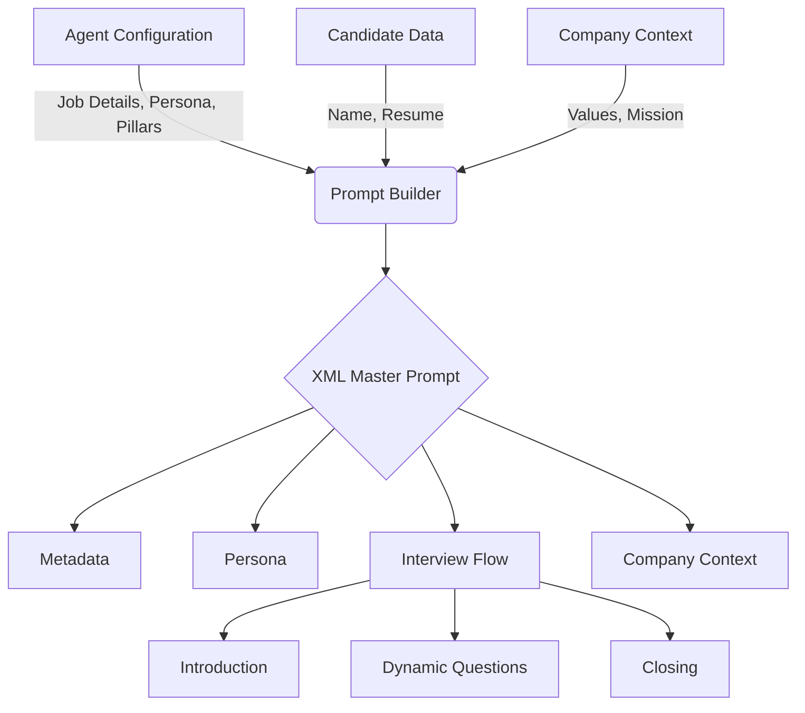
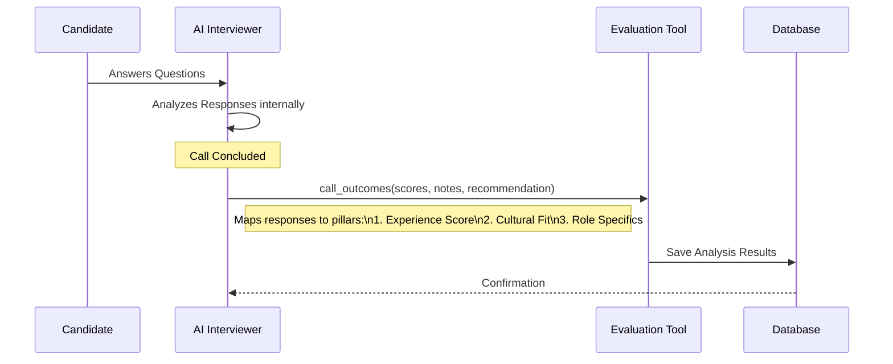

# HiringAI: The Future of Automated Recruitment 

##  Project Overview

**HiringAI** is an advanced AI-powered telephony platform designed to revolutionize the recruitment process by automating the initial phone screening round.

###  The Pain Points
Recruitment teams today face significant challenges:
*   **High Volume**: Reviewing hundreds of resumes and scheduling dozens of screening calls is overwhelming.
*   **Time-Consuming**: Initial screenings are repetitive, often asking the same questions to every candidate.
*   **Inconsistency**: Human bias and fatigue can lead to inconsistent evaluation of candidates.
*   **Slow Feedback Loops**: Scheduling conflicts delay the process, resulting in lost top talent.

###  The Solution
HiringAI solves these problems by deploying **AI Agents** that:
1.  **Call Candidates Automatically**: No more scheduling tag. The AI calls candidates at their convenience.
2.  **Conduct Structured Interviews**: The AI follows a strict, fair, and consistent interview script tailored to the job description.
3.  **Evaluate Instantly**: Real-time analysis of candidate responses against defined "pillars" (Experience, Culture, etc.).
4.  **Provide Actionable Insights**: Recruiters receive a detailed scorecard with recordings, transcripts, and hiring recommendations immediately after the call.

---

##  Dynamic Prompt Construction

The core of our AI interviewer is a dynamically constructed **XML Prompt**. This prompt ensures the AI stays in character, follows the interview flow, and adheres to company guidelines.

###  How We Build the Prompt
We assemble the prompt in real-time (`server/src/utils/promptBuilder.ts`) using the following context:

1.  **Metadata**: Specifics about the role (Job Title, Description) and the Candidate (Name).
2.  **Persona**: Defines the AI's personality (e.g., "Professional HR" vs. "Friendly Recruiter").
3.  **Company Context**: Background information about the company to answer candidate questions.
4.  **Interview Flow**: A structured guide containing the Introduction, Specific Questions, and Closing.

###  Prompt Architecture Diagram



### Example Prompt Structure
```xml
<ai_master_prompt>
  <metadata>
    <agent_name>Senior Recruiter</agent_name>
    <job_title>Senior Backend Engineer</job_title>
    <candidate_name>Alex Chen</candidate_name>
  </metadata>
  
  <Persona>
    <identity>Experienced Senior Recruiter conducting a professional yet engaging screening.</identity>
    <tone>Professional but warm, attentive, and encouraging.</tone>
  </Persona>

  <conversation_guidelines>
    <active_listening>Briefly acknowledge answers to bridge conversation naturally.</active_listening>
  </conversation_guidelines>

  <interview_flow>
    <introduction>Greet candidate warmly, break the ice, and verify identity...</introduction>
    <questions>
      <question order="1">Can you describe your experience with Node.js?</question>
      <question order="2">Tell me about a time you solved a complex bug.</question>
    </questions>
  </interview_flow>
</ai_master_prompt>
```

---

##  Structured AI Evaluation

Instead of vague summaries, HiringAI uses a **Tool-Based Evaluation System**. We define a strict schema that the AI *must* call at the end of the interview to submit its assessment.

### How It Works
We use a "Function Calling" mechanism (specifically `call_outcomes`) defined in `server/src/utils/promptBuilder.ts`.

1.  **Pillar-Based Scoring**: The user selects pillars (e.g., Experience, Cultural Fit).
2.  **Schema Generation**: The backend dynamically generates a JSON schema requiring a *Score (1-10)* and *Notes* for each selected pillar.
3.  **AI Execution**: As the call concludes, the AI model analyzes the entire conversation history and "calls the function" with the populated data.

###  Evaluation Flow Diagram



### The Evaluation Schema (JSON)
The AI fills out this exact structure for every candidate:

```json
{
  "name": "call_outcomes",
  "parameters": {
    "experience_score": { "type": "INTEGER", "min": 1, "max": 10 },
    "experience_notes": { "type": "STRING" },
    
    "cultural_fit_score": { "type": "INTEGER", "min": 1, "max": 10 },
    "cultural_fit_notes": { "type": "STRING" },
    
    "overall_recommendation": {
      "enum": ["strongly_recommend", "recommend", "neutral", "not_recommend"]
    },
    "summary": "Candidate demonstrated strong backend skills but lacked..."
  }
}
```
